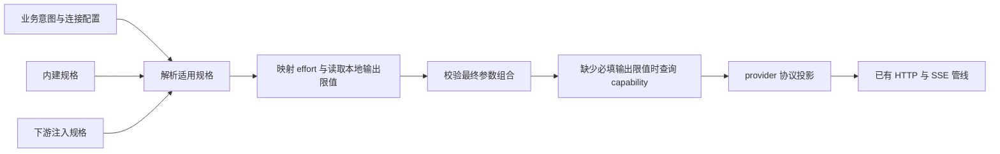

# Completion 模型规格与参数映射设计

日期：2026-10-01。状态：Chat、Anthropic 首版及后续 Gemini level 切片已实施并通过离线验收，包含 factory 注入；Responses/Codex 接入仍延期。设计经两轮独立审查与交叉质询修订，包含用户确认的通配规则及调查后采纳的多 ID 配置。实施前源码基线：`72cc91a`。Gemini 本轮另经三次真实生成验证，范围见末节。

建议引入统一的 model-specs 层。应用表达 `CompletionReasoningEffort` 等业务意图，独立的模型规格描述已知能力，provider adapter 将映射结果投影到协议。内建规格提供常用模型的开箱即用行为，下游可在客户端构造时注入补充规格或替换映射器。这个方向合理，而且可以在现有四包边界内落地。

关键取舍是：统一能力知识和映射流程，保留协议投影的差异。首版应解决输出上限与 reasoning effort，不建设通用请求重写引擎、模型路由器或远程规格服务。

最小运行模型是：**客户端持有一份已选定的不可变目录，依次采用精确 ID、最长前缀与全局兜底选择一条规格；规格提供输出限值、effort mapper 和模型约束；现有 adapter/dialect 唯一负责协议字段。** 用户已明确没有外部兼容性包袱，只有内部试用兄弟项目，允许破坏性 API 变更。现有测试用于识别语义变化，不要求为旧接口保留兼容层。

## 意图的合理性与限制

业务代码知道“这次任务需要 High”，通常不应该同时知道某模型有没有 `xhigh`、关闭思考要传 `none` 还是 `thinking.type`、Messages API 的输出上限是多少。把这些知识从业务配置中分离，能减少模型切换时的配置错误，也能让规格修订集中完成。

统一 effort 是相对投入意图，不是跨模型等效的计算量、质量、延迟或金额。向中间舍入是本库的产品政策，不是厂商协议事实。尤其 `Disabled→Low` 意味着尽量降低投入，而非保证禁止思考；如果应用需要严格禁止思考，必须在选择模型时排除强制思考模型，不能把该枚举作为硬保证。

内建规格以已知模型最大输出为目标，不另加更低的硬限制；下游可以显式设置未知模型的兜底限值。模型本身仍有输出和上下文上限，宿主仍可取消，不能保证所有推理都完成。`max_tokens` 是允许生成的上限，不等于一定使用这么多 token；“截断省不了钱”也不宜作为技术保证：截断可能减少已计费输出，却使业务结果无效并导致再次生成。应把**库维护的能力事实、宿主选择的兜底政策、完成状态与宿主期限**分别说明。

## 实施前代码与规格证据

| 位置 | 当前事实 | 对本方案的影响 |
| --- | --- | --- |
| [CompletionReasoningEffort.cs](../../src/Completion.Abstractions/CompletionReasoningEffort.cs) | 已有 ProviderDefault、Disabled、Low、Medium、High、XHigh、Max | 可复用业务语义，不必新增厂商专属枚举 |
| [CompletionConnections.cs](../../src/Completion/CompletionConnections.cs) | effort 是连接配置；业务配置不允许自设 output-token cap | 首版保持这些入口，不把 model specs 塞入 CompletionRequest |
| [AnthropicMessageConverter.cs](../../src/Completion/Anthropic/AnthropicMessageConverter.cs) | 已接收外部解析的 maximum；effort 直接转字符串，Disabled 直接写 thinking.disabled；启用 effort 时写 adaptive 和 summarized | converter 已有分层起点，但缺模型能力约束 |
| [AnthropicClient.cs](../../src/Completion/Anthropic/AnthropicClient.cs) | 五个精确 Opus ID 内建 128,000；其他 ID 查询 Models API；404/405/501 后用 32,768 | 迁出内建表即可共享知识；fallback 是兼容估值，不能称为模型最大值 |
| [OpenAIChatClient.cs](../../src/Completion/OpenAI/OpenAIChatClient.cs) | Strict 直接映射；DeepSeek 分支 Low/Medium/High 全发 high，XHigh 抛异常；Qwen 用开关 | 存在真实的多种投影，适合共享选择规则、分别写 wire |
| [OpenAIResponsesProtocolProfiles.cs](../../src/Completion/OpenAI/OpenAIResponsesProtocolProfiles.cs) | 已有 mapper delegate；公开 Responses 与 Codex 分离 profile | 可以接入公共映射结果，不能合并协议身份 |
| [ProviderModelMaximumCache.cs](../../src/Completion/ProviderModelMaximumCache.cs) | 按客户端内精确 ID 共享在途查询，保留 waiter 取消与清理边界 | 继续复用；无需新增缓存框架 |
| [CompletionDispatchIdentity.cs](../../src/Completion/CompletionDispatchIdentity.cs) | fingerprint 含原始 effort；adapter 修订采用当前实现，没有 mapping label 恢复门禁 | specs 不应顺手引入版本标签或新恢复协议 |

本次复核支持两个核心模型案例：

- GLM-5.3 的普通 API effort 集合为 `low/high/max`，默认 `max`，不支持关闭思考；Coding Plan 对额外名称有不同归一行为。但本库采用统一舍入政策后，两者可以共享已核查的标准挡位集合，别名差异本身不要求新增 profile 身份。[Z.ai thinking 文档](https://docs.z.ai/guides/capabilities/thinking)
- DeepSeek 当前 Chat API 明确接受 `none/low/high/max`，并兼容 `minimal→low`、`medium/xhigh→high`。因此仓内 `Low→high` 已不符合当前能力，`XHigh` 也可以按本库政策映射为 `high`。[DeepSeek Chat API](https://api-docs.deepseek.com/api/create-chat-completion/)

以下两项是实施前发现的调查偏差；本轮已同步校准相应调查页，区分厂商事实与库内映射政策：

1. [glm-5.3.md](specs/models/glm-5.3.md) 把“不应静默降级”混入协议事实。服务器拒绝非法值，不意味着本库不能按公开政策先映射合法值。该页“未发现 Responses 接口”也已与模型页列出的 Chat、Responses、Messages 三种协议不一致；这些入口的具体参数不能因此推定完全相同。[Z.ai 模型页](https://docs.z.ai/guides/llm/glm-5.3)
2. [deepseek-v4-1-flash.md](specs/models/deepseek-v4-1-flash.md) 将 Chat 上 medium/xhigh 列为未证实；当前 Chat 文档已明示接受并归一。reasoning 回传也有条件：带 tools 的请求需要回传此前各轮 reasoning_content；不带 tools 时服务器忽略它。后者是 replay 合同，不放入本次参数映射。[DeepSeek Chat API](https://api-docs.deepseek.com/api/create-chat-completion/)、[Thinking Mode](https://api-docs.deepseek.com/guides/thinking_mode/)

本次确认的是官方文档合同，尚未实测 HTTP 接受情况。Markdown 调查页提供证据，运行时使用经审核的结构化规格；不能把调查中的建议直接自动编译成协议事实。

## 分层与调用流程

推荐在 `Atelia.Completion` 内建立 `ModelSpecs` 命名空间。Abstractions 继续只承载业务枚举与消息合同；Tools 无需依赖或理解规格。



规格解析和 effort 映射应是无 I/O 的确定性操作。只有选中规格没有提供必填输出限值，或未命中任何规格时，才进入现有异步 capability 查询。命中前缀或全局规则并取得限值就直接采用，不先 GET，再按错误码启用兜底。规格与工具组合的确定性本地校验必须先于凭据读取和 Models GET，不能在 GET 后再声称发生了 dispatch 前拒绝。

协议投影应消费最终映射结果。不要先让旧 converter 写出字段，再在 HTTP handler 中删除或替换字符串。后置 filter 容易留下相互矛盾的 thinking、effort、tool_choice，也会让前置校验检查错对象。

这里的 param filter 应理解为**投影前按选中规格归一**。目录中没有匹配规则时，走当前表面的协议默认映射，不自行猜测模型族。透传指现有统一枚举的协议映射，不代表新增任意用户 JSON 参数入口。

## 规格作用域与匹配

运行时目录在客户端构造时冻结，支持精确 ModelId、末尾一个 `*` 的前缀模式及 `*` 全局规则，全部采用 `StringComparison.Ordinal` 的区分大小写语义。服务作用域由“这个客户端选了哪份目录”表达，不再额外公开 ProfileId、双键、endpoint 注册表或 URL 自动识别规则。

内建目录按已选择的 client/dialect 提供合理默认：标准 Chat 可包含已核查的 GLM-5.3 标准参数知识；DeepSeek dialect 选择 DeepSeek Chat 目录；Anthropic client 选择原生 Messages 目录。客户端选择仍决定 wire 写法、usage 和 replay，不因命中某模型就自动改变 dialect。Responses 的既有协议 profile 与 ApiSpecId 保持原职责。

默认目录表达一个明确假设：使用这些精确 ID 的服务遵循所登记的模型合同。Anthropic 因而继续在代理 endpoint 上使用精确 Opus ID 的内建 maximum，无需先匹配官方域名。这是默认知识政策，不是对任意 gateway 的兼容保证。如果代理限制、私有路由或产品模式改变能力，宿主应显式注入相应目录或 `Empty`，不能让库靠地址和模型名前缀猜测。

下游传入的目录替换客户端默认目录；需要默认知识时，从对应内建目录显式派生。不同客户端可以持有不同目录，即使其中有同名 ID 也不会跨目录查询。目录名称和适用协议留在工厂名称、注释与文档中，不成为恢复身份。

注入留在客户端 options 与 factory 构造参数。业务 connection 文件继续只写模型、服务地址和 effort；factory 可接受按 connection 选择目录的构造期函数，得到的目录随客户端冻结。不新增连接 JSON 版本或可联网 resolver。

匹配和覆盖规则：

1. **精确匹配优先**：下游精确 ID 条目可替换内建同 ID 条目；任何前缀或全局规则均不能盖过精确条目。内建目录首版仍只登记精确 ID，不内置猜测性的通配兜底。
2. **最长匹配前缀其次**：没有精确条目时，`claude-opus-*` 优先于 `claude-*`。`*` 匹配零个或多个后缀字符，前缀按字面值匹配；不依赖注册顺序。
3. **全局规则最后**：没有精确或非空前缀命中时才采用 `*`；仍未命中则使用协议默认映射及已有 capability 机制。
4. **只选择一条完整规格**，不逐字段合并，也不因字段缺省重新匹配。精确条目缺输出限值时查询 capability，不从 `claude-*` 补值；更长前缀缺字段时也不向更短前缀或 `*` 借值。需要小改时，代码用不可变记录 `with` 显式派生完整条目。
5. 批量构造中的重复精确 ID 或重复模式是构造错误；`WithModel`、`WithModels`、`WithPattern` 则明确替换列出的 key。不同但重叠的前缀合法，由最长前缀裁决。同长度的两个不同前缀不可能同时命中，故无需优先级数字或平局机制。
6. 多个明确 ID 可通过 `WithModels(modelIds, spec)` 一次登记，在构造时展开成独立精确 key，共享不可变规格对象。alias 和前缀匹配均不改写实际 ModelId；不做大小写转换、自动去掉日期或跨目录 alias 解析。

| 查询结果 | 采用的规格 |
| --- | --- |
| 内建已知 `claude-opus-5-5`，同时存在用户 `claude-*` | 内建精确条目，除非用户显式替换该 ID |
| 无精确条目的 `claude-opus-future`，同时存在 `claude-opus-*` 和 `claude-*` | `claude-opus-*` |
| 无精确条目的其他 `claude-` 开头 ID | `claude-*` |
| 无精确或前缀命中，但配置了 `*` | 全局规则 |

`WithModels` 的列表成员均为精确 ID，`WithModel` 是单 ID 的便捷入口；二者不接受通配模式。`WithPattern` 仅接受非空字面前缀加末尾单个 `*`，或单独的 `*`。拒绝中间／多个 `*`、`?`、字符组等 glob 语法；不解释正则，不支持条件表达式、优先级权重或排除规则。前缀规则可携带与精确条目相同的规格字段，是宿主对匹配集合的明确声明；它不增加 adapter 的协议投影能力。

实现只需精确字典和构造时按前缀长度降序排列的不可变规则列表；全局规则可视为最后一个空前缀。每次先查字典，再扫描列表，成本随规则数量线性增长，无需先建设 trie、规则缓存或通用匹配引擎。

首版只需不可变目录的普通 lookup 与派生操作，无需 public resolver 接口、全局可变注册表或热更新。纯映射器的代码替换接口有用户明确需求，应提供。

### 多个 ID 共享规格：需求证据与配置边界

本次调查（2026-10-01，官方文档核查，未在线调用）的结论是**采纳非空的精确 ID 列表配置**。现有设计已经允许多个 ID 引用同一规格对象，列表只是把重复登记变成一个构造操作，不改变运行时匹配机制。

| 官方证据 | 对本设计的含义 |
| --- | --- |
| Claude 官方列出短别名与日期版 ID；Google Cloud 在较早模型上采用 `@日期` 形式，例如 `claude-haiku-4-5@20251001` | 同一模型存在多种命名形式是实际情况，维护重复规格有成本；不同平台仍须分别确认协议与能力。[Model IDs and versioning](https://platform.claude.com/docs/en/about-claude/models/model-ids-and-versions) |
| OpenRouter 文档以 `anthropic/claude-3-5-sonnet` 与 `anthropic/claude-3.5-sonnet` 展示 slug alias 解析 | 连分隔符也可能形成别名，不能只靠前缀覆盖；文档例子证明命名需求，不承诺旧模型当前可调用。[OpenRouter Models](https://openrouter.ai/docs/guides/overview/models) |
| OpenRouter 的 `:nitro`、`:floor` 等 routing variants 沿用基础模型能力元数据；catalog variants 如 `:free` 则有独立条目 | 有限的路由名称可显式共享规格；不能自动剥离所有后缀，也不能把所有 variant 都当能力相同的别名。[Model variants](https://openrouter.ai/docs/guides/routing/model-variants/overview) |

只把规格的匹配输入改成 `modelIds` 列表：`CompletionConnectionConfig.ModelId` 与 `CompletionRequest.ModelId` 仍是单个实际调用值。列表不是请求中的候选模型集合，不代表自动选模型、失败后改用另一个别名或发送多个 ID。服务作用域仍属于客户端目录；原生 Claude、Google Cloud 或 OpenRouter 的名字不能仅因指向相似模型就自动跨协议共用整条规格。

首版仍为代码配置，提供 `WithModels(IReadOnlyList<string> modelIds, CompletionModelSpec spec)`。内部先复制并校验完整列表，再把每个 ID 登记到同一不可变精确字典。列表不能为空，成员不得为空或纯空白，不接受通配模式；同列表内重复 ID 按 Ordinal 拒绝。批量构造时，不同列表展开后的 ID 冲突同样拒绝，即使它们引用相同 spec；`WithModels` 作为显式更新操作则替换已存在的列出 ID，返回新目录，失败不产生部分更新。

展开后不保留别名组身份，不建立 canonical ID 或别名关系图。把 A、B 一起登记后，再用 `WithModel(A, anotherSpec)` 只改变 A，B 仍指向原规格；两者未声明的字段均不互相补齐。capability 查询、远端结果与 dispatch identity 继续使用实际请求 ID，不因共享 spec 而合并缓存或持久身份。

无别名时可统一使用 `["one-id"]`，也可用 `WithModel("one-id", spec)` 这一薄包装省掉方括号；两者完全复用相同构造逻辑。无需为这个增强新增连接 schema、支持 JSON 的“字符串或数组”联合类型，或引入文件解析器。多前缀仍使用既有 `WithPattern`，本轮不扩成混合精确／通配列表。

浮动别名需要单独维护：Claude 官方说明较早模型的短别名可指向更新的日期快照，而 4.6 及之后的无日期 ID 是固定快照。列表表达配置者对当前共享规格的声明，不保证服务器别名永远不变；能力有差异时应分开登记规格。此增强不自动增加任何模型内建条目。[Model IDs and versioning](https://platform.claude.com/docs/en/about-claude/models/model-ids-and-versions)

## 最小规格结构

每条规格只放当前请求映射需要的数据；字段可分别缺省，不把“已指定输出限值”误当成“已知 reasoning 支持集合”。

| 字段 | 内容 | 责任 |
| --- | --- | --- |
| ReasoningMapper | 纯语义 mapper | 从框架意图得到有效挡位和厂商名称 |
| OutputTokenLimit | 该规格选定的正整数输出上限 | 内建填已核查的模型最大值，下游可填明确的兜底假设；仍不放入业务请求 |
| ForcedToolChoiceSupported | 可空的明确模型事实 | false 无条件拒绝；true 允许当前已支持的 adaptive 组合；null 采用 adapter 的保守规则 |

不引入通用 Constraints 容器和 DefaultThinking 三态。首批 Opus 5.5 的 forced-tool 禁令是无条件的，直接声明 false 即可。`ProviderDefault` 仍只表示省略，并不表示关闭；以后出现确需依据服务默认状态校验的实际模型，再增加那个具体条件。

来源 URL、核查日期和适用模式保留在 C# 条目注释及 Markdown specs，不作为每条运行时规格的必填模块。

字段 `OutputTokenLimit` 表示该规格选择发送的输出上限，不保证每条用户规则的值都是真实模型 maximum。内建值需要能力依据；用户在精确、前缀或全局规则中可以声明限值，也可以明确采用未知模型的兜底假设。值必须为正整数，不能误填 context window；标准 streaming 与 Batch beta 的能力依据必须区分。

宿主兜底设低可能截断，设高可能被服务端拒绝；这是宿主显式选择的政策，不是库认证的模型能力。保持一个限值字段和现有投影即可，不新增置信度、来源枚举或第二套 fallback 配置。业务请求仍没有逐次调用的 output-token cap。

首版已实现的 public API 合同如下；类型位于 `Atelia.Completion.ModelSpecs`：

```csharp
public sealed record CompletionModelSpec {
    public ICompletionReasoningEffortMapper? ReasoningMapper { get; init; }
    public int? OutputTokenLimit { get; init; }
    public bool? ForcedToolChoiceSupported { get; init; }
}

public interface ICompletionReasoningEffortMapper {
    ReasoningEffortMapping Map(CompletionReasoningEffort requested);
}

public readonly record struct ReasoningEffortMapping(
    CompletionReasoningEffort EffectiveEffort,
    string? WireLevel);
```

mapper 仅处理六种显式意图，结果的 EffectiveEffort 只能是 Disabled 或五种启用挡位；不允许 ProviderDefault 或未定义 enum。省略由统一入口处理，不再在结果中重复编码 Omit/Disabled/Enabled 三态。

EffectiveEffort 表示归一后的语义意图，WireLevel 表示厂商字符串，不能从字符串反推是否关闭。字符串 effort 投影要求启用结果有非空名称；关闭结果可携带厂商自定义名称，例如 `off`，未提供则使用该协议的标准关闭写法。固定开关投影不需要名称，也不声称支持五种实际深度；配置了它不能消费的名称时应明确拒绝，不能忽略配置假装已映射。

映射器实例在构造后不可变，`Map` 无副作用且允许并发调用。自定义映射器只能替换语义映射，不获得整个请求 DTO、HTTP handler、消息或 credential。目录应复制并冻结输入集合；对 mapper 的不可变与纯函数要求则是扩展合同，库不能把任意用户对象自动变成纯函数。结果仍须通过 adapter 的可消费性和组合校验。

## Reasoning 的确定规则

### ProviderDefault 与 Disabled

`ProviderDefault` 不参与排序，总是省略显式 reasoning 控制。它保留服务器默认，不映射成 Medium，也不根据本库记住的服务默认填一个显式 max/high。

统一入口先处理 ProviderDefault，再调用可替换 mapper；自定义 mapper 也不能把这个意图变成显式参数。其可替换范围是其余六个显式意图的映射政策。

`Disabled` 独立处理：支持关闭就输出 Disabled 计划；不支持关闭则选择最低可用的启用挡位，常见情况是 Low。即使模型没有 Low，也必须明确落到它实际支持的最低启用挡位。

启用 effort 的舍入集合不包含 Disabled。请求 Low，而模型仅支持 Disabled 和 High 时，应得到 High，不能为了“最近”而关闭思考。若模型根本没有可调节的启用挡位，应使用专门的开关映射器或明确声明非思考模型；空集合不能含糊地当作透传。

### 向 Medium 舍入

对启用挡位采用独立的语义顺序 `Low < Medium < High < XHigh < Max`，不依赖 enum 的整数值。

1. 请求的挡位在集合中：原样保留。**不会把已支持的 Max 自动降成 Medium。**
2. 请求低于 Medium，且该挡位缺失：取大于请求的最小可用挡位；不存在时取集合最大值。
3. 请求高于 Medium，且该挡位缺失：取小于请求的最大可用挡位；不存在时取集合最小值。
4. 请求为 Medium，且 Medium 缺失：按上述语义顺序选离 Medium 最近的挡位；等距时取较高者。因此集合 Low/High/Max 得到 High。

这把用户提出的“向 medium”解释为缺失挡位向中间收敛，而非始终找绝对最近挡位。比如集合 Low/Max 上的 XHigh 得到 Low，即便 Max 在序列上更近；模型确有这种稀疏集合时，下游可用显式映射表覆盖默认政策。

这个算法对启用挡位应保持单调，并且映射结果再映射一次保持不变。它不承诺每次转换都更省 token；Medium→High、Disabled→Low 都可能增加投入。

| 业务意图 | GLM-5.3 普通 API | DeepSeek Flash Chat | Claude Opus 5.5 Messages |
| --- | --- | --- | --- |
| ProviderDefault | 省略 | 省略 | 省略 |
| Disabled | low | 关闭 | low |
| Low | low | low | low |
| Medium | high | high | medium |
| High | high | high | high |
| XHigh | high | high | xhigh |
| Max | max | max | max |

表中是**推荐的本库映射**，不是厂商的兼容字符串归一表。GLM Coding Plan 接受 xhigh 并归一到 max，但本库已知集合上的 XHigh 仍按统一政策映射到 high。Opus 5.5 的五个启用挡位及不可关闭行为由官方 effort 文档确认。[Anthropic Effort](https://platform.claude.com/docs/en/build-with-claude/effort)

### 两种配置入口，共享一个数据映射器

推荐只实现一个名称字典与舍入算法核心，提供两种易用配置工厂：

- `ForSupportedLevels(levels, supportsDisabled)`：由实际启用集合生成标准名称字典。GLM 是典型使用者；支持 Disabled 时，关闭结果不指定自定义名称，由 adapter 使用标准写法。
- `ForNamedLevels(names)`：字典的启用 key 定义实际挡位集合；可选的 Disabled key 声明支持关闭及其厂商名称。拒绝 ProviderDefault key、未定义 enum 和空名称，不再维护第二份 SupportedLevels。

两者复用同一算法和验证，不必为两种输入形式创建两个独立 mapper 类型。启用集合必须非空；仅开关或仅非思考模型不伪装成空的挡位字典。

现有 Qwen adapter 仍将 Disabled 写为 false，其他显式投入意图写为 true，ProviderDefault 省略；它不注册一份声称模型实际支持五种深度的规格。开关路径上的 EffectiveEffort 保留业务意图，只用于区分启用与关闭。

例如名称字典 `{ Disabled: "off", Low: "standard", High: "extended" }` 上，Disabled→Disabled/off，Medium→High/extended，XHigh→High/extended，Max→High/extended。关闭项不参与启用舍入。这是配置者对厂商名称的语义声明，库不能仅凭名称自行推断顺序。

如果宿主需要为每个 enum 成员指定完全不同的行为，可用自定义 mapper 实现一张完整的输入映射表，包括 Medium、XHigh 等缺失挡位；它替代默认舍入政策。普通 named-levels 字典则只描述实际挡位，不承担输入重定向。首版不必为二者都建设 JSON DSL。

### 协议投影与扩展边界

mapper 解决“选择什么挡位、叫什么名字”；已有 adapter/dialect 解决“写哪个字段、附带哪个开关”。不新增每条规格的 WireBinding，也不让规格与 dialect 分别选择投影。现有行为包括：

| adapter 行为 | 典型 wire | 说明 |
| --- | --- | --- |
| Chat effort 字符串 | reasoning_effort | 启用用映射字符串；关闭用自定义名称或标准 none |
| Chat thinking 开关加 effort | thinking.type 与 reasoning_effort | DeepSeek 当前实现可继续保留这条已用路径；Disabled 时不遗留 enabled effort |
| Responses effort | reasoning.effort | 保持现有 profile；以后接入规格时不自动沿用 public OpenAI 的 summary:auto 到所有兼容服务 |
| Anthropic adaptive 与 effort | thinking.type 与 output_config.effort | 仅用于确实接受该模式的模型；保留当前 summarized 策略 |
| Qwen thinking 开关 | chat_template_kwargs.enable_thinking | 不假造具体推理深度 |

adapter 必须验证结果可消费性：字符串 effort 不能缺名称，固定开关不能接受无法表达的自定义字段。DeepSeek 的 Anthropic 兼容表面不能只套原生 Claude adaptive 写法；要接入它，必须确认并实现相应投影，不因有 specs 就声称该 client 已兼容整套服务。

这也说明“多参数”并非都应该延期：DeepSeek 开关加 effort 和当前 Anthropic adaptive 加 effort 已在代码里，是首版必须支持的固定投影。延期的是旧 Claude 手工 budget_tokens 映射、同一客户端逐模型选择任意请求形状、参数表达式与 JSON patch。出现真实需求时增加那个具体 mapping 结果和 provider 投影，复用目录查询与意图入口；允许届时调整 API，无需现在建公开 projector 插件或脚本运行器。

## 输出限值的解析与未知模型

Anthropic Messages 的 max_tokens 是必填生成上限；不同模型上限不同，thinking 也计入总输出限制。[Messages API](https://platform.claude.com/docs/en/api/messages/create)、[Thinking 输出限制](https://platform.claude.com/docs/en/build-with-claude/thinking)

推荐顺序为：

1. 按精确 ID、最长前缀、全局规则选出一条规格；若其 OutputTokenLimit 有值，直接用于必填输出字段，不发 Models GET。
2. 未命中规格，或选中规格没有该字段时，沿已实现且受此表面支持的 capability 查询取得模型 maximum，作为本次输出限值。
3. 查询没有返回合法 maximum 时，按既有 HTTP 或协议错误分类失败，不发生成 POST；库不自行补一个估值。

“未知模型尽量透传”有这个无法绕过的例外：必填数值没有合法的省略形式，库必须得到数值才能 POST。下游可用精确、前缀或全局规则提供限值；原生协议字段仍由 adapter 写入，无需应用处理每种 wire 形式。

在 Anthropic 纵向切片中撤去当前 404/405/501 后由库默认填 32,768 的成功路径，允许用户通过目录中的通配规则显式声明兜底。例如 `claude-*` 可为无精确条目的 Claude ID 指定 OutputTokenLimit，`*` 可覆盖目录中的其他未知 ID。库默认值既可能截断较大模型，也可能超过较小模型的上限；宿主通配规则则清楚表达由谁选择并承担这个假设。

如果某兼容服务只实现 Messages、缺少 Models API，宿主提供匹配规则中的限值即可直接 POST；未提供则在 capability 阶段失败。**通配规则在 I/O 前静态选择**，不先 GET 再在 404/405/501 后套用，也不在生成 POST 被拒后切换另一规则、调整数字或重试。实施时直接替换旧默认兜底测试，并注明显式规则与旧隐式估值的区别。

Models GET 的所有非 2xx，包括 404/405/501，均通过现有 CompletionFailureException 保留 HTTP 事实；transport failure 与取消保持现有边界。成功响应的 maximum 缺失、非法或畸形沿用 InvalidDataException。未知模型的 404 也可能意味着 ID 不存在，而非 Models API 未实现；不解析自然语言错误文本区分，也不改写成本地请求拒绝。

本地规则限值直接读取，不放入 capability 事实缓存；缺省才使用 ProviderModelMaximumCache。复用其成功缓存、失败不缓存及共享查询清理规则；远端 maximum 按实际 ModelId 缓存，不能因为两个 ID 命中同一前缀而共享查询结果。缓存属于固定客户端与 endpoint，不能成为跨服务的全局缓存。首版不增加“禁止 discovery”选项或综合能力查询框架。

对目前省略输出上限的 Chat/Responses 协议，首版保留当前省略行为，不能声称省略就一定获得模型最大输出。DeepSeek Chat 文档明示存在随思考模式变化的有限服务端默认值；如果以后要把“避免低于模型能力的硬上限”贯彻到这类表面，需要另立小步，确认其上下文约束并支持用规格中的真实 maximum 投影可选字段。这不应混进本次 Anthropic 必填参数迁移。Gemini 已主动查询并发送 maximum，后续切片采用本地规格优先、缺值才查询，不因 API 可省略就改变现有政策。[DeepSeek Chat API](https://api-docs.deepseek.com/api/create-chat-completion/)

## 组合校验与错误边界

所有会改变 thinking 状态的映射必须先于工具选择校验。当前 BuildToolChoice 检查原始 effort 是否 ProviderDefault/Disabled；采用 Disabled→Low 后继续用它会错误放行。ProviderDefault 也不能解释为关闭。

推荐让 provider adapter 使用 mapper 结果与明确模型事实检查组合。Opus 5.5 的 ForcedToolChoiceSupported=false 无条件拒绝 RequiredAny/RequiredNamed，覆盖 Disabled→Low、ProviderDefault 和其他输入；无需先推断默认 thinking，也不能把 RequiredAny 改成 Auto。[Anthropic thinking 与工具选择](https://platform.claude.com/docs/en/build-with-claude/thinking)

当前“所有启用 thinking 均禁止 forced tool choice”的校验过宽：官方区分手工 extended 与 adaptive，并有模型例外。已核查支持当前 adaptive 组合的模型可声明 true，移除这项过宽禁令；其他工具、历史与格式校验仍执行。null 表示未提供事实，沿用 adapter 的保守规则，但检查映射后的显式 effort，而非原始输入；ProviderDefault 保持未确认语义，不伪造关闭。以后若接入 manual budget，不能拿 adaptive 的 true 给它放行。

哪些可以归一、哪些应该拒绝，需要区分：

- effort 缺少挡位：按公开政策自动映射，这是相对投入提示。
- RequiredNamed/RequiredAny、输出格式、历史依赖：是业务要求，不能自动削弱。
- 温度等参数：本次业务合同没有统一提供这些字段，不预建删除清单。以后增加时再依据明确事实处理，不删除未知字段“提高成功率”。

构造期规格错误用参数/配置异常；自定义 mapper 违反结果合同属于扩展配置错误，也不伪装成 provider 拒绝。凭据读取和网络调用前的确定性组合拒绝使用现有 CompletionRequestRejectedException，稳定 ASCII reason 可为 `model_specs.incompatible_tool_choice`。不要在错误字段拼入 prompt、凭据、reasoning 或未经处理的 provider 内容。

[CompletionRequestRejectedException.cs](../../src/Completion.Abstractions/CompletionRequestRejectedException.cs) 明定其证明边界是 credential/network dispatch 前。Models GET 已经发生网络调用，之后的失败不能变成 `model_specs.output_maximum_unknown` 本地拒绝，也不能仅因没有生成 POST 就改变异常分类。

正常 effort 舍入不是失败，也无需每次 Warning。HTTP/transport 错误继续通过 CompletionFailureException.Failure；provider terminal 失败仍通过 CompletionResult.Failure。新增层不重试、不引入 timeout、不修改 Completed/Incomplete/Failed 分类。

## 下游配置与内建知识维护

首版提供代码配置，不新增连接文件解析器。当前源码的用法如下：

```csharp
var specs = BuiltinModelSpecs.StandardChat
    .WithModel("private-glm-route", new CompletionModelSpec {
        ReasoningMapper = ReasoningEffortMappers.ForSupportedLevels(
            [CompletionReasoningEffort.Low,
             CompletionReasoningEffort.High,
             CompletionReasoningEffort.Max],
            supportsDisabled: false)
    });

var client = new OpenAIChatClient(apiKey, httpClient,
    dialect: OpenAIChatDialects.Strict,
    options: new OpenAIChatClientOptions {
        ReasoningEffort = CompletionReasoningEffort.Medium,
        ModelSpecs = specs
    });
```

这里新增的是私有路由的能力声明，实际发送的 ModelId 仍是 `private-glm-route`。业务配置仍可独立选择 Medium；目录注入不改变消息、usage、timeout 或 replay。业务只使用连接文件时，由 factory 构造期函数按 connection 选择这份目录即可。

`ModelSpecs` 未指定表示采用 client/dialect 的默认目录；显式 `CompletionModelSpecCatalog.Empty` 表示不使用内建模型知识；传入其他目录表示只使用该目录，不再隐式叠加默认条目。`WithModel` 是明确的不可变替换操作；批量构造中重复 ID 则拒绝，二者不混淆。

多个明确名称共用规格可一次登记。以下是 OpenRouter 路由 variant 的配置示意；`sharedSpec` 是宿主为此 Chat 表面已选定的规格，不在示例中推断 effort 集合或输出数字：

```csharp
var openRouterSpecs = CompletionModelSpecCatalog.Empty
    .WithModels(
        ["openai/gpt-5.2",
         "openai/gpt-5.2:nitro",
         "openai/gpt-5.2:floor"],
        sharedSpec);
```

三项都成为精确条目，优先于前缀规则；请求原样发送用户选择的那一个 ID，保留服务端路由后缀。列表数量和顺序不增加匹配优先级；名称只在该目录内声明共享规格，不注册全局别名。

Anthropic 未知模型兜底可写为以下 API；`fallbackTokens` 是宿主事先选定的正整数，不代表本文认证的模型 maximum：

```csharp
var anthropicSpecs = BuiltinModelSpecs.AnthropicMessages
    .WithPattern("claude-*", new CompletionModelSpec {
        OutputTokenLimit = fallbackTokens
    });
```

这保留已知模型的精确条目；未知且以 `claude-` 开头的 ID 命中该规则，省略 Models GET，reasoning 则因规则未提供 mapper 而采用协议默认映射。若宿主希望所有未知 ID 都有限值，可显式追加 `WithPattern("*", ...)`；希望为某子族采用不同假设，则追加更长前缀。`WithPattern` 替换相同模式时返回新目录，批量重复模式仍拒绝。

内建条目以随 Completion 包版本发布的不可变 C# 数据维护，注释链接到带来源、核查日期及适用模式的 Markdown specs。多个 ID 可共用规格对象，不为每个模型创建 class。首版不新增独立 NuGet 包、联网更新、抓取 Markdown、启动时抓网页或模型价格数据库。

已实施的首批内建条目：

| 条目 | 首版内容 | 边界 |
| --- | --- | --- |
| claude-opus-4-6 / 4-7 / 4-8 / 5 / 5-5 | 迁入当前精确 maximum 表 | reasoning 与约束逐模型核查，不共享一个“所有 Claude”模板 |
| claude-opus-5-5 | 五挡、Disabled→Low、ForcedToolChoiceSupported=false | 标准 Messages；默认 thinking 是文档事实，首版不另存字段；不加入 Batch beta |
| glm-5.3 | Low/High/Max，关闭不支持；标准 Chat 目录 | 已核查共同能力可共享条目；Flash 的精确 ID 与其他协议须分别确认 |
| deepseek-flash | Disabled 与 Low/High/Max；当前 DeepSeek Chat 投影 | 旧 alias 经官方逐条确认后登记；文件名不是模型 ID |

不要自动注册 `deepseek-v4-1-flash` 仅因为调查文件叫这个名字，也不要默认注册大小写变种。其他 OpenAI/Codex/Gemini 模型可以复用设施，但本次不把未核查模型全纳入内建列表。

本次官方 Models API 已列出 max_tokens 与 capabilities，包括 effort 和 thinking。这为未来补充 discovery 提供依据，但首版只复用现有 maximum 查询；不建设综合能力抓取器，也不将服务端兼容别名直接视为独立行为挡位。[Anthropic Models API](https://platform.claude.com/docs/en/api/models/retrieve)

## 身份与可观测性

保持当前 CompletionDispatchIdentity 的职责：原始业务 effort 进入现有 fingerprint；adapter 修正使用当前实现。specs 的修订日期、网页 URL、catalog hash 不自动成为恢复门禁，目录选择也不改写 reasoning Origin/ApiSpecId。确定性的本地映射不意味着服务端 alias 或模型默认行为永远不变。

首版不增加 public 请求预览、运行时 Evidence DTO 或持久化计划。普通目录 lookup 与纯 mapper 已可供配置代码检查；实际调用复用一个 internal 解析路径，fixture 验证最终 wire。出现实际设置界面或运行支持消费者时，再设计对应查询，并明确同步本地结果与异步 capability 查询的差别。

动态 maximum 可沿用现有诊断，不能依赖 Release 中被裁掉的 Debug 调用来保证产品功能，也不新增日志框架或全部请求日志。

## 实施顺序与验收

先完成两个可以直接调用真实 client 并用离线 fixture 验收的纵向切片，不先铺全部 adapter 的横向设施：

1. **Chat 切片**：不可变目录、精确 ID 列表展开及精确／最长前缀／全局选择、一个数据 mapper 核心和两种工厂、自定义 mapper 入口，直接接入 OpenAIChatClient 与 factory 注入。登记 glm-5.3 和 deepseek-flash 的适用条目，用 GLM 舍入、DeepSeek Low/XHigh、私有 ID 厂商名称及 Empty/未命中路径的 HTTP fixture 验收。协议投影留在当前 dialect，Qwen 开关不虚构五挡。
2. **Anthropic 切片**：把精确 maximum 表迁为默认目录的 OutputTokenLimit，接通用户精确／通配限值与 Opus 5.5 effort；用窄工具支持事实及映射后 effort 做 GET 前校验。选中规格缺限值才沿现有 cache 查询，移除隐式 32,768 估值并保留 HTTP/协议异常分类。用内存 HTTP/SSE 和 capability 并发取消测试验收这一整条路径。

Responses/Codex 的规格接入仍不作为首版前置工程。Gemini 已在后续独立切片复用目录和 mapper，见 [实施记录](#gemini-后续切片与验收)；仍不能把“设施可复用”写成“所有客户端已支持注入”。其他协议出现已核查的规格或真实宿主需求后再接入，不新增空接口。

每个切片同步 public 使用说明及相关调查中的事实/政策边界。改动限于 Completion 包的配置映射；允许直接调整拟议 API，不改业务请求、连接文件版本或兄弟项目实现。

建议验收覆盖：

| 验证 | 应证明的行为 |
| --- | --- |
| 舍入的全部非空启用集合 | 保留受支持值、向中间舍入、Medium 等距取高、单调、幂等；Disabled 独立处理，ProviderDefault 不排序 |
| 名称映射和自定义 mapper | off/standard/extended 语义与名称分别正确；两种工厂共用规则；非法或不可消费结果在凭据/HTTP 前报配置错误；自定义表确实替代默认政策 |
| 目录与作用域 | 同 ID 在两个客户端目录中独立解析；默认/Empty/显式目录、整条替换、原 ModelId 不变、输入集合冻结 |
| 多 ID 配置 | 单项与多项列表等价于逐条登记；同列表／批量跨列表冲突及空项拒绝；显式更新先校验完整列表；修改输入列表不影响目录；单 ID 后续替换不波及其他别名 |
| 规则选择 | 精确条目优先于用户前缀／全局；最长前缀；零长度后缀；全局及未命中；区分大小写；与注册顺序无关；同 key 显式替换、批量重复及非法模式拒绝 |
| 无字段合并 | 精确或更长前缀条目缺限值时不向较短规则借值；缺 mapper 时走协议默认；已知 ID 的整条替换不会重新继承内建字段 |
| 真实 client 加内存 HTTP/SSE fixture | 上表七种意图生成预期 wire；未知 Strict 模型继续当前标准映射；未知 Unsupported dialect 仍明确拒绝，不假装透传成功 |
| Anthropic 组合 | 模型 false 覆盖 Disabled→Low 与 ProviderDefault；已核查 adaptive true 不被过宽禁令拦截；null 检查最终显式 effort；确定性拒绝在凭据与 GET 前，工具要求不削弱 |
| 输出限值 | 内建、用户精确、前缀及全局限值均不发 GET；无规则限值才查询并按实际 ID 缓存 maximum；404/405/501 保持 HTTP 失败且不 POST，畸形成功保持 InvalidDataException；不在错误后切规则、改限值或重试 |
| capability 缓存与取消 | 同前缀或同一精确 ID 列表中的不同 ID 不共享远端 maximum；本地兜底不进入 capability 缓存；查询失败不缓存，原 token/共享清理规则保持 |
| 协议边界回归 | 原生 reasoning payload 和 Origin 不变；tool adjacency、prompt cache、terminal、usage unknown 与取消合同不变 |

算法测试可以遍历五个启用挡位的 31 个非空子集，用性质约束和明确案例验收，而非只复制 switch 做断言。对不支持启用的模型另测专门开关行为。

实施改代码后，按根 README 和 CI 环境关闭 live opt-in，再串行运行受影响测试与常规离线套件。若更改包元数据或 README，则遵守唯一候选版本、Pack 与独立 Test-Package 消费者验收。在线验证独立报告 provider、协议/dialect、实际 model-id 和终止状态；fixture 通过不代表服务器已接受全部配置。

## 本轮收敛与下一轮条件

需求来源应区分：内建知识、下游扩展、两种映射配置与可替换 mapper，以及精确优先／最长前缀／全局兜底和宿主显式限值，来自用户要求及后续确认；协议投影、取消/失败及原生 reasoning 边界来自当前源码和合同。精确 ID 列表由用户提出调查并授权自行决策，本文依据官方命名实例与构造期展开的局部性予以采纳。Medium 等距取高、稀疏集合的定向舍入和客户端默认采用 canonical 合同仍是本文的推荐政策，不能冒充厂商事实或用户已逐项确认的决定。后续确认已放宽原稿的“仅精确匹配”与“所有规格限值必须是真实 maximum”约束。

| 裁决 | 本轮结果 |
| --- | --- |
| keep | 精确 ID 优先、客户端目录作用域、有效意图与厂商名称、ProviderDefault 省略、映射后组合校验、现有 I/O 边界 |
| add | 用户确认的末尾星号前缀与全局规则；宿主显式 OutputTokenLimit；静态选中一条完整规格；本次调查后采纳的精确 ID 列表配置 |
| merge | spec 的 WireBinding 并入既有 adapter；两个数据 mapper 合为一个核心和两种配置工厂 |
| simplify | ProfileId 双键改为客户端选定目录；三态映射结果改为 enum 加名称；通用约束改为本轮工具支持事实；实施改为两个纵向切片 |
| delete | endpoint 推断框架及 32,768 估值成功路径；GET 后伪装本地拒绝的建议 |
| defer | public 预览、runtime Evidence、DefaultThinking、旧 budget 和任意字段投影，以及尚无具体规格消费者的其他协议接入 |

两轮审查已在核心机制与失败边界上收敛，没有需要第三轮裁决的新失败类别。**不建议现在继续一轮泛化方案完善**，下一步应验证上述纵向切片。若实施出现同一客户端必须按模型改变字段结构、依赖服务器默认状态的条件约束、真实预览消费者，或在线合同与已登记知识冲突，再针对该证据开下一轮；未决推荐政策若被用户调整，也应局部修订，不据此重建通用框架。

## 首版实施与验收记录

当前工作区已落地以下实现；没有新增包或连接 schema：

- [ModelSpecs](../../src/Completion/ModelSpecs/CompletionModelSpecCatalog.cs)：不可变目录、多精确 ID 构造期展开、末尾星号及全局选择、完整规格替换；[ReasoningEffortMappers](../../src/Completion/ModelSpecs/ReasoningEffortMappers.cs) 提供共享舍入核心、两种数据工厂及可替换接口。
- [Chat client](../../src/Completion/OpenAI/OpenAIChatClient.cs)：`OpenAIChatClientOptions.ModelSpecs`；默认目录按 dialect 选择，DeepSeek wrapper 已透传同一 options。
- [Anthropic client](../../src/Completion/Anthropic/AnthropicClient.cs)：构造参数 `modelSpecs`；先解析映射和校验，选中本地限值直接 POST，否则沿既有 maximum cache 查询。没有新增 Anthropic options 类或兼容层。
- [DefaultCompletionClientFactory](../../src/Completion/CompletionConnections.cs)：构造期 `modelSpecsSelector` 函数；只在创建 Chat/Anthropic/Gemini 时调用一次，null 使用默认目录。Responses 不调用它。
- [快速上手](quick-start.md#5-分离业务意图与模型规格) 增补当前源码用法；三份调查同步校准。没有自动登记额外模型别名或推定旧 Opus 的工具支持；显式 true 的 adapter 路径由 fixture 验证。

2026-10-01 于 Windows、根 `global.json` 的 .NET SDK 10.0.201 执行：

1. `dotnet build Atelia.Completion.slnx -c Release -t:Rebuild`：成功，0 警告、0 错误。
2. 按 CI 关闭全部 live opt-in 与 `OPENROUTER_API_KEY`，运行 Release `--no-build` 离线测试，排除 `Category=LiveE2E/LocalE2E`：991 通过，3 跳过，0 失败。跳过项均为 Unix 文件权限/所有权场景；没有把它们当作 Windows 验收成功。
3. 验收包含 31 个非空启用集合的性质、目录顺序/冻结/覆盖、两个 provider 的真实 client 内存 HTTP/SSE 请求、factory 注入、capability 失败及共享查询取消回归。另由独立只读审查核对源码与关键 fixture；主线程复核并执行集成验证。

上述 Chat/Anthropic 首版验收没有执行在线模型调用、Pack、提交、推送或发布；包元数据与 README 未修改。内存 fixture 验证库生成的请求及合同，不证明远端实际接受所有配置。新增 API 属于当前源码，不宣称已经进入文档安装示例固定的旧包版本。

## Gemini 后续切片与验收

2026-10-01 按 [Gemini 接入调研](gemini-model-specs-research.md) 补齐第三个切片。新增 GeminiClientOptions，默认目录为 BuiltinModelSpecs.GeminiGenerateContent；七款已核查现代文本模型同时登记短 ID 与 models/ 形式，每条为 65,536、三挡 mapper。Disabled→Low、XHigh/Max→High，ProviderDefault 省略 thinkingConfig。没有增加公共规格字段或改动业务连接 schema。

显式 effort 要求选中 mapper，未知或缺 mapper 在 HTTP 前报不支持；自定义启用结果仅可使用原生 minimal/low/medium/high 或文档化大写形式，不能用字符串藏数值预算。规格 false 拒绝 forced tool choice；null/true 保持 Gemini 原有 ANY 与指定函数投影。本地消息、工具与 replay 投影先于 GET；选中限值直接 POST，缺值才沿原 cache 查询。

Release Rebuild 成功，0 警告、0 错误。受影响离线测试 190 通过；完整离线回归 1,064 通过、3 项 Unix 文件权限/所有权测试在 Windows 跳过。新增在线测试另经 Release 构建，以 ATELIA_RUN_GEMINI_MODEL_SPECS_LIVE=1 执行：2 项真实测试通过，合计 0 GET / 3 POST，均 HTTP 200 / Completed。覆盖 3.5 Flash-Lite 的 Disabled→low 与 3.8 Flash 的强制命名工具、签名及 functionResponse.id 续轮；详情及归档见 [生产客户端实测](specs/models/gemini-generate-content.md#生产客户端接入验收)。CI 默认关闭新 live 开关。

2.5 budget、thought 摘要、Vertex 与 Interactions 未接入；其他模型完整档位矩阵及非法轮次的在线拒绝尚未验证。没有修改包元数据或 README，也没有 Pack、提交、推送或发布。
